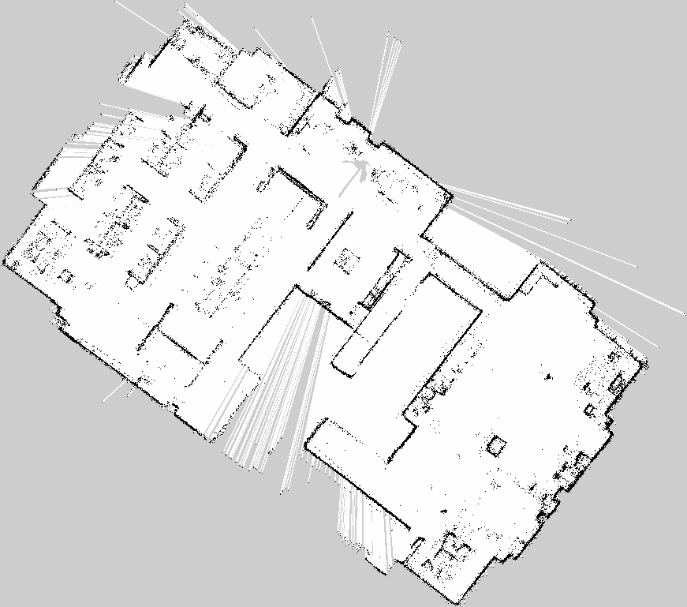

# LiDAR SLAM

main branch는 ROS1 melodic 버전입니다.
*** 

## ROS2 version
ROS2는 branch를 따로 만들었습니다.

### 1. ROS2 galactic 
* Ubuntu 20.04 LTS
* ROS2 galactic 

ROS2 galactic은 ros2_galactic branch를 참고해주세요.


### 2 .ROS2 humble 
* Ubuntu 22.04 LTS
* ROS2 humble 

ROS2 humble은 ros2_humble branch를 참고해주세요.

***

## ROS1 version 
* Ubuntu 18.04 LTS
* ROS1 melodic 

*** 

### LeGO-LOAM

#### 1.Dependencies
* ROS melodic
* gtsam
```
wget -O ~/Downloads/gtsam.zip https://github.com/borglab/gtsam/archive/4.0.0-alpha2.zip
cd ~/Downloads/ && unzip gtsam.zip -d ~/Downloads/
cd ~/Downloads/gtsam-4.0.0-alpha2/
mkdir build && cd build
cmake ..
sudo make install
```
#### 2.Compile
```
cd ~/bstar_ws/src
git clone https://github.com/bstar-robotics/slam.git
cd ~/bstar_ws/
catkin_make
```


#### 3.Run

```
roslaunch lego_loam run.launch
```

***

### Faster-LIO


#### 1.Dependencies
* ROS melodic
* glog  
```sudo apt-get install libgoogle-glog-dev```
* eigen  
```sudo apt-get install libeigen3-dev```
* pcl  
```sudo apt-get install libpcl-dev```
* yaml-cpp  
```sudo apt-get install libyaml-cpp-dev```

#### 2.Compile
```
sudo add-apt-repository ppa:ubuntu-toolchain-r/test
sudo apt update
sudo apt install gcc-9
cd /usr/bin
sudo rm gcc g++
sudo ln -s gcc-9 gcc
sudo ln -s g++-9 g++


cd ~/bstar_ws/src/fatser-lio/thirdparty
tar -xvf tbb2018_20170726oss_lin.tgz
mkdir ../build && cd ../build
cmake .. -DCUSTOM_TBB_DIR=`pwd`/../thirdparty/tbb2018_20170726oss

```
#### 3.Run
```
roslaunch fatser_lio mapping_ouster_os0_32.launch
```


***


## Octomap 
Octomap은 2D grid map을 만들어주는 package입니다. 

원본코드 : <https://github.com/OctoMap/octomap_mapping>


#### 1. Dependencies
```
sudo apt install ros-melodic-octomap ros-melodic-octomap-mapping 
```


#### 2. Complie 

```
cd ~/bstar_ws/src
git clone https://github.com/bstar-robotics/slam.git
cd ~/bstar_ws/
catkin_make
```

#### 3. Run 

octomap package만 사용하는 법입니다.
```
roslaunch octomap_server octomap_mapping.launch 

```

#### 3.1. Run with LeGO-LOAM
위에 LeGo-LOAM과 같이 사용하는 launch 파일은 LeGO-LOAM에 있습니다.
```
roslaunch lego_loam 2d_grid_run.launch
```

#### 4. Parmaeters 
2d_grid_run.launch.py 파일안에 octomap Node의 parameter를 조정할 수 있습니다. 

높이는 0.2 ~ 1.5사이로 지정해두었습니다. 

```
<node pkg="octomap_server" type="octomap_server_node" name="octomap_server">
		<param name="resolution" value="0.05" />
		<!-- <param name="/use_sim_time" value="true" /> -->
		<!-- fixed map frame (set to 'map' if SLAM or localization running!) -->
		<param name="frame_id" type="string" value="map" />
		
		<!-- maximum range to integrate (speedup!) -->
		<param name="sensor_model/max_range" value="200.0" />
		
		<!-- data source to integrate (PointCloud2) -->
		<remap from="cloud_in" to="/registered_cloud" />
		<!-- <param name="base_frame_id" value="base_link"/> -->

        <!-- <param name="incremental_2D_projection" type="bool" value="true"/> -->
		<param name="pointcloud_min_z" type="double" value = "0.2" />
		<param name="pointcloud_max_z" type="double" value = "1.5" />
		<param name="occupancy_min_z" type="double" value = "0.2" />
		<param name="occupancy_max_z" type="double" value = "1.5" />
	</node>

```

#### 5. Map save 

##### 5.1 Install
```
sudo apt install ros-melodic-map-server
```
##### 5.2 Run 

```
rosrun map_server map_saver -f ~/2d_grid_map map:=/projected_map

```
2d_grid_map.pgm과 2d_grid_map.yaml 파일 2개가 저장됩니다. 


#### 6.Result
맵 이미지 파일은 2d_grid_map.png 입니다.

원래 이미지 저장은 .pgm 확장자로 저장되지만 업로드를 위해 확장자를 .png로 바꿔주었습니다. 
<p align='center'>
    
</p>


2d_grid_map.yaml 파일에 맵에 대한 정보가 있습니다.


