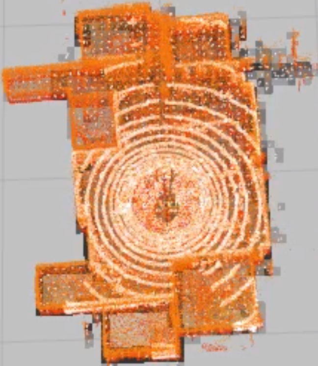

# experiment environment
1. ROS Melodic
> * ubuntu 18.04
2. Dataset
> * 2023-01-18-23-05-02_sunnyvale_office.bag
# Requirements

* PCL
```
 sudo apt-get install libpcl-dev
```
* OpenMP
```
sudo apt-get install libomp-dev
```
* pcl_ros
```
sudo apt-get install ros-melodic-pcl-ros
```
# Installation
```
cd /your/catkin_ws/src
git clone https://github.com/koide3/ndt_omp
git clone https://github.com/SMRT-AIST/fast_gicp --recursive
git clone https://github.com/koide3/hdl_global_localization
git clone https://github.com/bstar-robotics/slam.git

cd /your/catkin_ws
catkin_make -DCMAKE_BUILD_TYPE=Release
```
# run
```
rosparam set use_sim_time true
roslaunch hdl_localization hdl_localization.launch
```
현재 2023-01-18-23-05-02_sunnyvale_office.bag 데이터 셋으로 맵을 만들었기 때문에 해당 데이터 셋의 시작 위치가 initial pose로 되어 있습니다. 다른 데이터 셋으로 테스트할 경우 launch file에 initial_pose를 변경해 주어야 합니다. 
```
rosbag play --clock bst_sunnyvale.bag
```


